# BOM Images

This directory contains images for the BOM components.

| BOM/CAD Name | Preview | Filename | Comment |
|------|---------|----------|---------|
| CCoreSupport |  | [CCoreSupport.png](CCoreSupport.png) | |
| CElecBox | [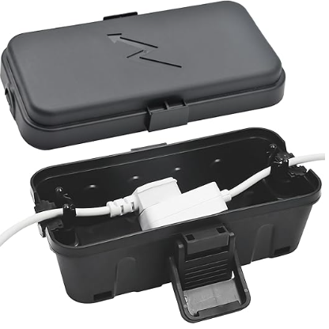](c_elecbox.png) | [c_elecbox.png](c_elecbox.png) | |
| CMesh | [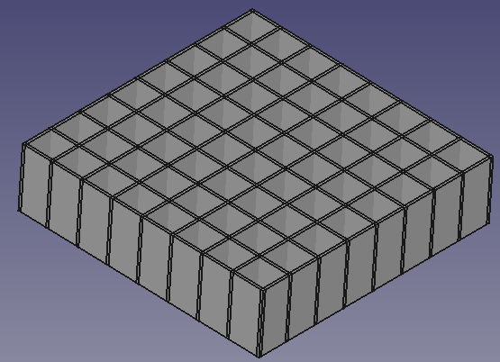](CMesh.png) | [CMesh.png](CMesh.png) | |
| ContractionCore | [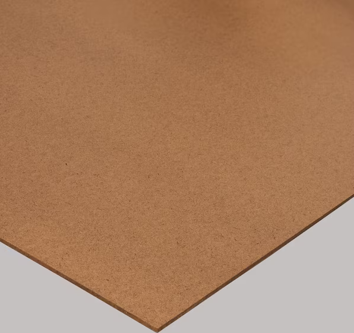](ContractionCore.png) | [ContractionCore.png](ContractionCore.png) | |
| DElecBox | [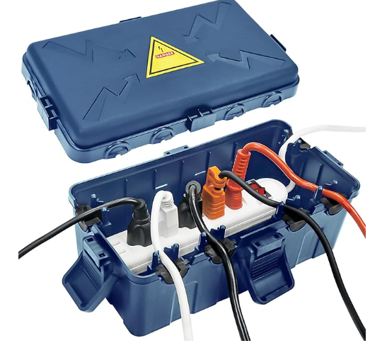](diff_electbox.png) | [diff_electbox.png](diff_electbox.png) | |
| DFMain | [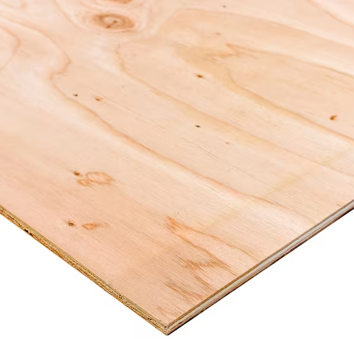](DFMain.png) | [DFMain.png](DFMain.png) | |
| DS001 | [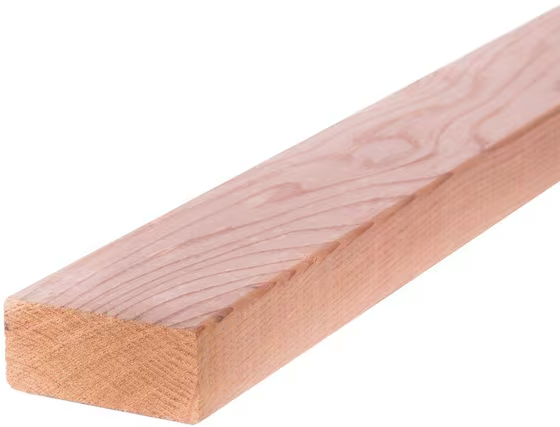](DSupport.png) | [DSupport.png](DSupport.png) | |
| DWheel | [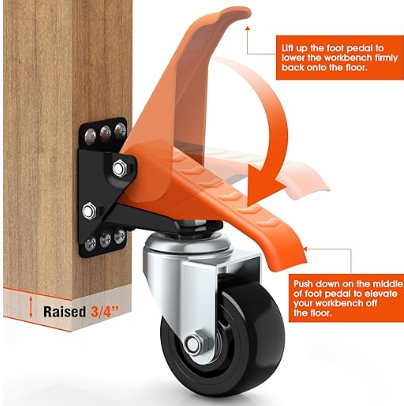](wheels.png) | [wheels.png](wheels.png) | |
| Fan | [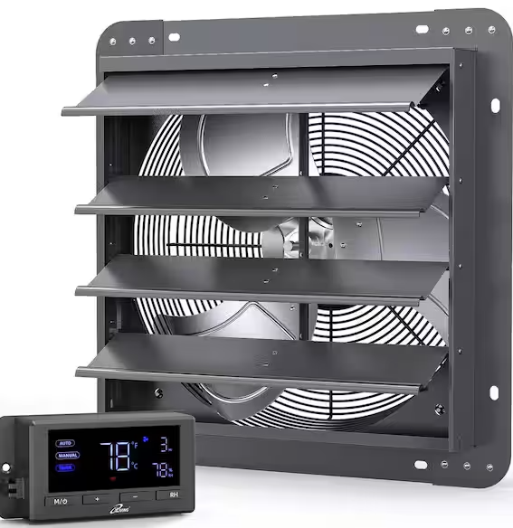](Fan.png) | [Fan.png](Fan.png) | |
| FanConnector | [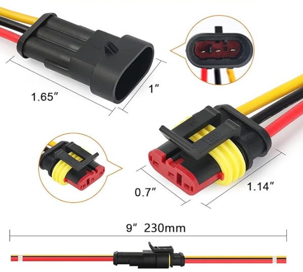](FanConnector.png) | [FanConnector.png](FanConnector.png) | |
| FanMesh0 | [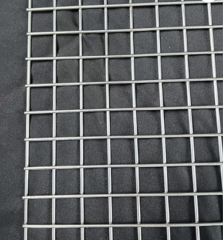](FanMesh0.png) | [FanMesh0.png](FanMesh0.png) | |
| FanMesh1 | [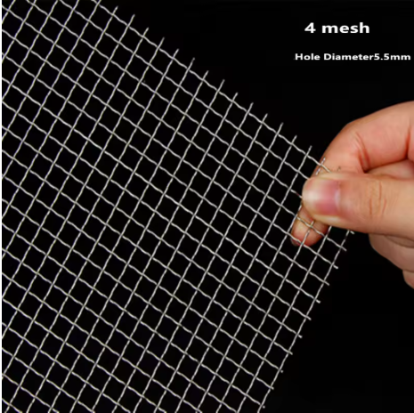](FanMesh1.png) | [FanMesh1.png](FanMesh1.png) | |
| Handle | [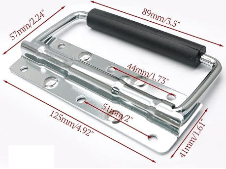](Handle.png) | [Handle.png](Handle.png) | |
| Latch | [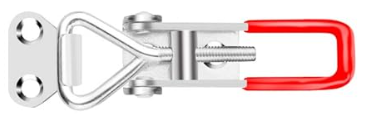](Latch.png) | [Latch.png](Latch.png) | |
| LoadCellAmp | [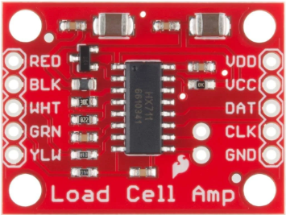](LoadCellAmpImage.png) | [LoadCellAmpImage.png](LoadCellAmpImage.png) | |
| Paint |  | [AcrylicPaint.png](AcrylicPaint.png) | |
| RaspberryPi4 | [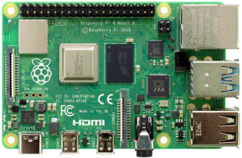](RaspberryPi4.png) | [RaspberryPi4.png](RaspberryPi4.png) | |
| RaspberryPiPico | [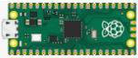](RaspberryPiPicoImage.png) | [RaspberryPiPicoImage.png](RaspberryPiPicoImage.png) | |
| Screws | [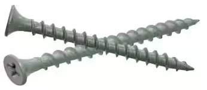](screws.png) | [screws.png](screws.png) | |
| Sealant | [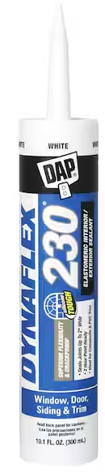](Sealant.png) | [Sealant.png](Sealant.png) | |
| Sealer |  | [Sealer.png](Sealer.png) | |
| SmartPiTouchPro3 | [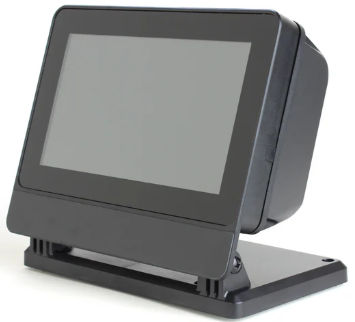](SmartPiTouchPro3.png) | [SmartPiTouchPro3.png](SmartPiTouchPro3.png) | |
| SmokeCharger | [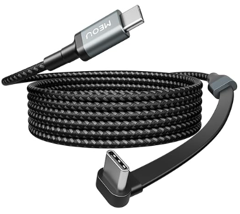](usbc.png) | [usbc.png](usbc.png) | |
| SmokeCopper | [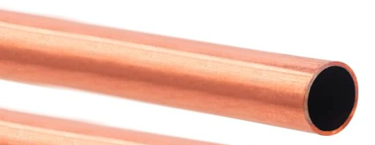](smokecopper.png) | [smokecopper.png](smokecopper.png) | |
| SmokeGenerator | [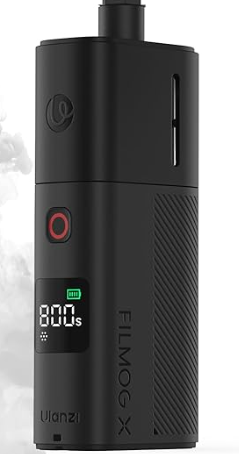](fogmachine.png) | [fogmachine.png](fogmachine.png) | |
| SmokeTube | [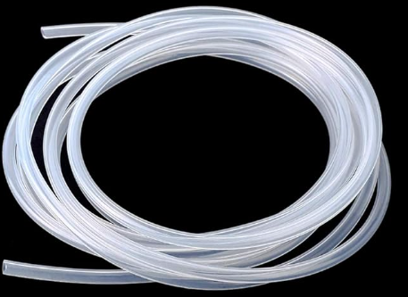](smoketube.png) | [smoketube.png](smoketube.png) | |
| Spacers |  | [Spacers.png](Spacers.png) | |
| TElecBox | [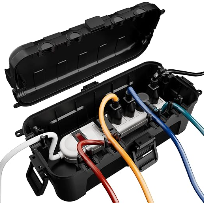](test_elecbox.png) | [test_elecbox.png](test_elecbox.png) | |
| TouchDisplay2 |  | [TouchDisplay2.png](TouchDisplay2.png) | |
| TPAluBottom |  | [TPAluBottom_Image.png](TPAluBottom_Image.png) | |
| TPBottom | [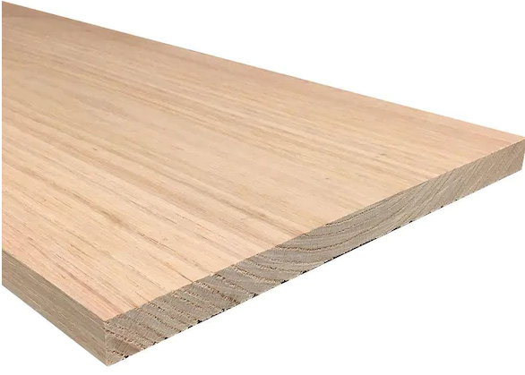](TPBottom1x12.png) | [TPBottom1x12.png](TPBottom1x12.png) | |
| TPBottomSupport | [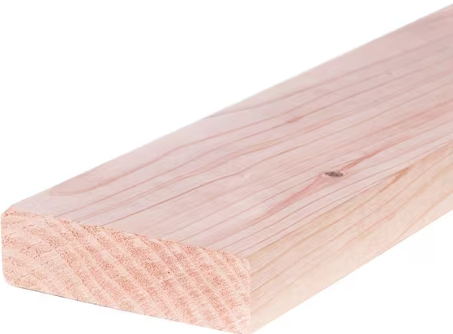](TPBottomSupport.png) | [TPBottomSupport.png](TPBottomSupport.png) | |
| TPDC12V | [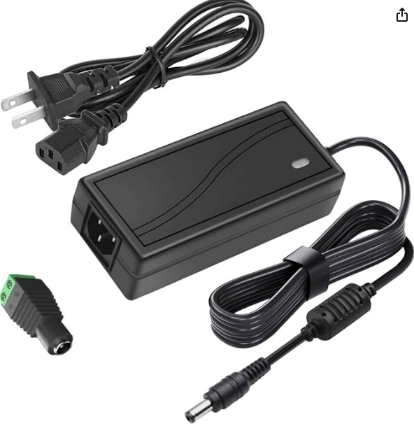](dc12v.png) | [dc12v.png](dc12v.png) | |
| TPDC5V | [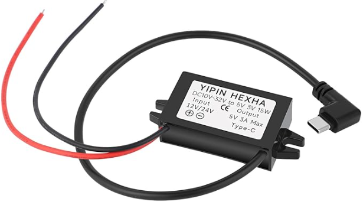](TPDC5V.png) | [TPDC5V.png](TPDC5V.png) | |
| TPDC7V5 | [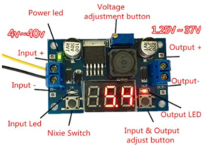](TPDC7V5.png) | [TPDC7V5.png](TPDC7V5.png) | |
| TPDrag0 | [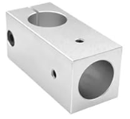](TPDrag0.png) | [TPDrag0.png](TPDrag0.png) | |
| TPDrag1 | [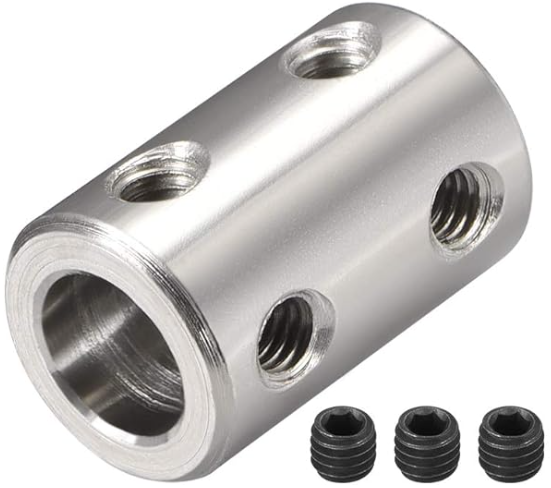](TPDrag1.png) | [TPDrag1.png](TPDrag1.png) | |
| TPDrag2 | [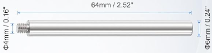](TPDrag2.png) | [TPDrag2.png](TPDrag2.png) | |
| TPHRod | [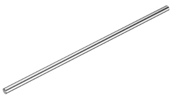](TPHRodImage.png) | [TPHRodImage.png](TPHRodImage.png) | |
| TPHVBearing | [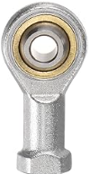](TPHVBearingImage.png) | [TPHVBearingImage.png](TPHVBearingImage.png) | |
| TPLoadCell | [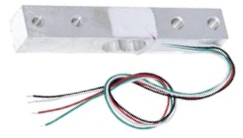](TPLoadCellImage.png) | [TPLoadCellImage.png](TPLoadCellImage.png) | |
| TPLoadCellSpec1 | [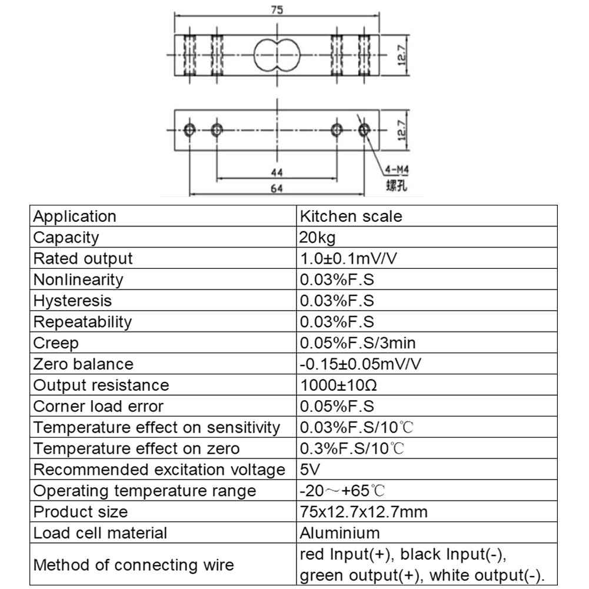](TPLoadCellSpec1.jpg) | [TPLoadCellSpec1.jpg](TPLoadCellSpec1.jpg) | |
| TPLoadCellSpec2 | [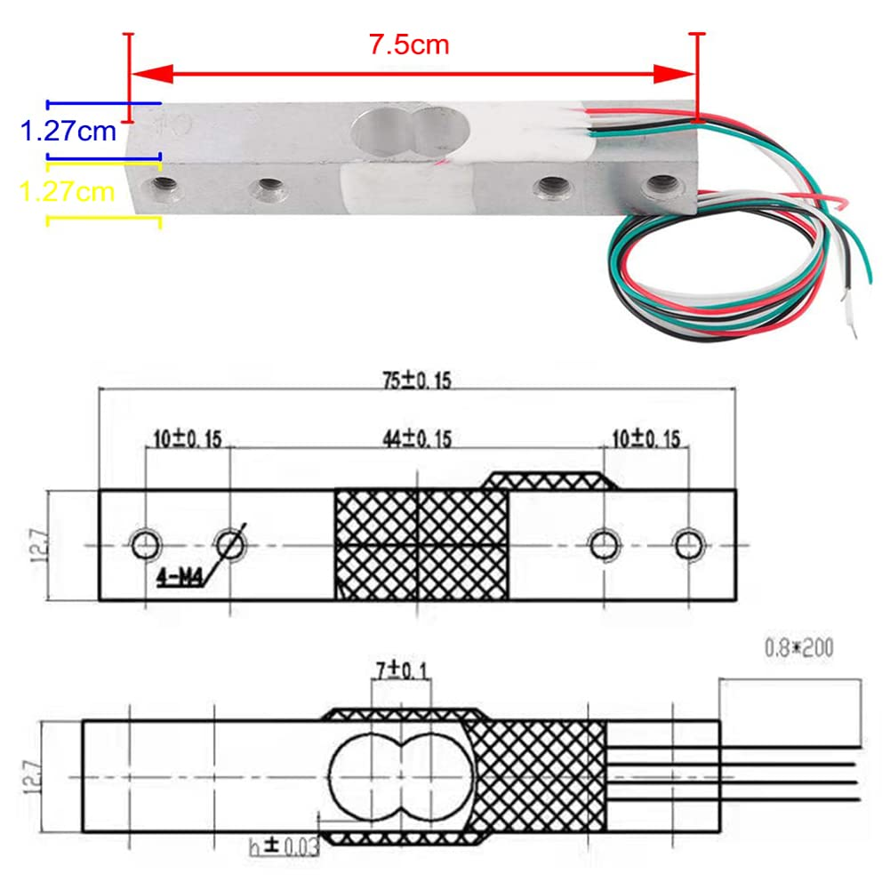](TPLoadCellSpec2.jpg) | [TPLoadCellSpec2.jpg](TPLoadCellSpec2.jpg) | |
| TPServo | [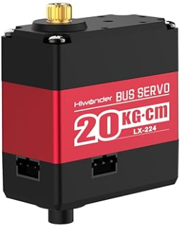](TPServo_Image.png) | [TPServo_Image.png](TPServo_Image.png) | |
| TPServoAluBase | [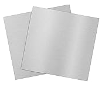](TPServoAluBase_Image.png) | [TPServoAluBase_Image.png](TPServoAluBase_Image.png) | |
| TPServoDB | [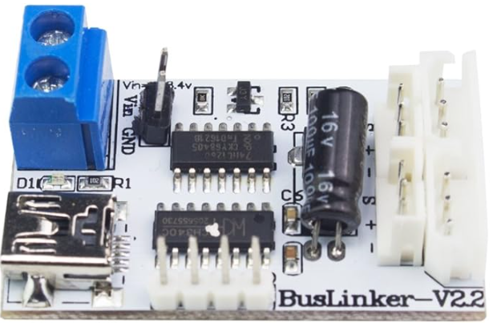](TPServoDB_Image.png) | [TPServoDB_Image.png](TPServoDB_Image.png) | |
| TPServoDisc | [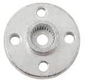](TPServoDiscImage.png) | [TPServoDiscImage.png](TPServoDiscImage.png) | |
| TPServoFlange | [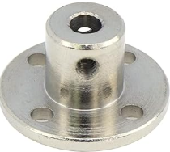](TPServoFlangeImage.png) | [TPServoFlangeImage.png](TPServoFlangeImage.png) | |
| TPServoSupport | [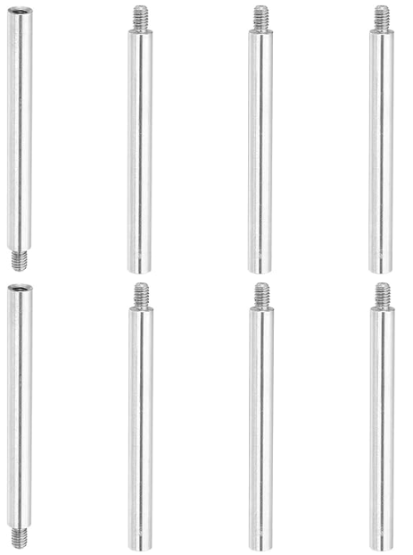](TPServoSupport.png) | [TPServoSupport.png](TPServoSupport.png) | |
| TPSupport | [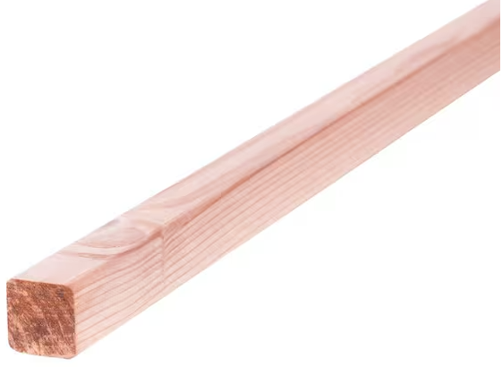](TPSupport2x2.png) | [TPSupport2x2.png](TPSupport2x2.png) | |
| TPVRod | [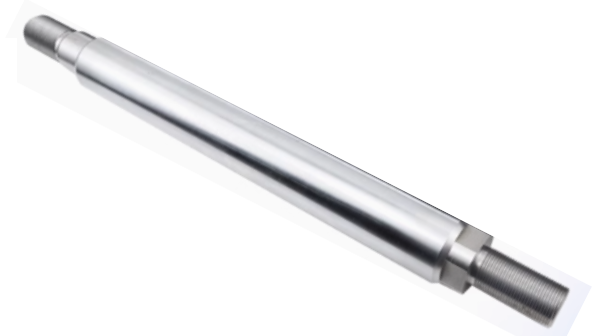](TPVRodImage.png) | [TPVRodImage.png](TPVRodImage.png) | |
| TSecBase | [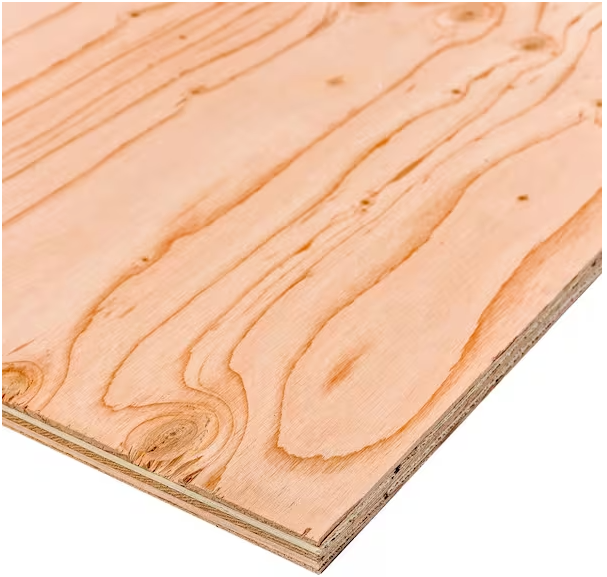](TSecBase.png) | [TSecBase.png](TSecBase.png) | |
| Wing | [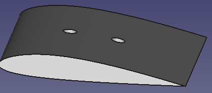](wing.png) | [wing.png](wing.png) | |