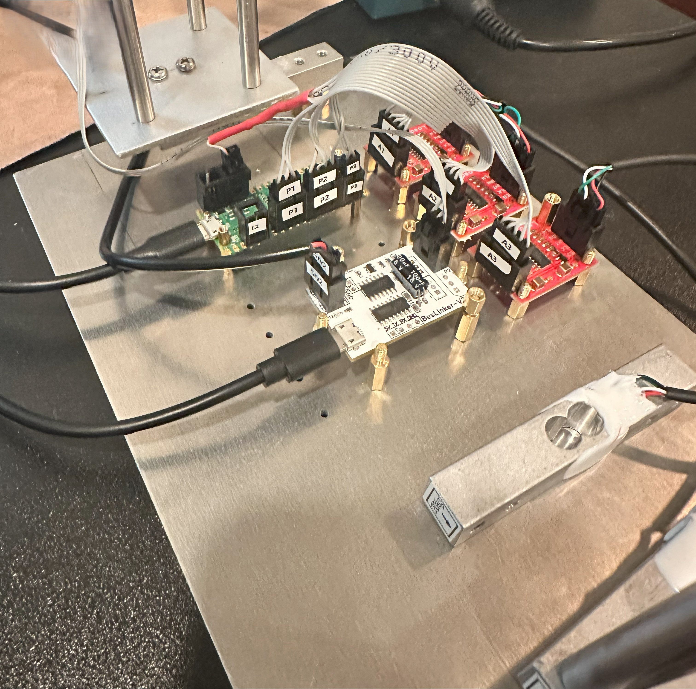

# Electrical

This directory contains the Electrical Circuit design files for the Wind Tunnel project.

* [Schematic.pdf](Schematic.pdf): the schematic diagram of the test platform's electrical circuit.
* [Schematic.svg](Schematic.svg): SVG version of same schematic for easy viewing.

The circuit components are mounted on an aluminum plate, using M2/M3/M4 standoffs to separate the components from the surface.

The aluminum plate is then secured to the test platform baseboard using wood screws.

Below is the image of the build::

Below is the image before mounting to the baseboard:

