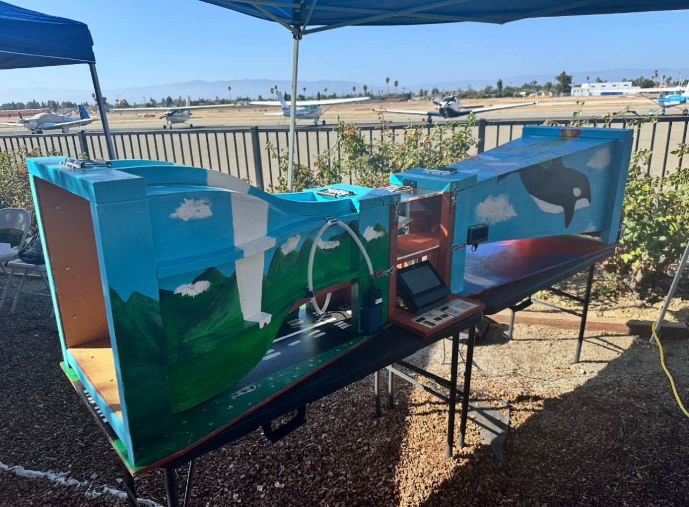

# Hardware

This directory contains the hardware design files for the Wind Tunnel project.

* [windtunnel.FCStd](windtunnel.FCStd) : 3D CAD model of the wind tunnel, created using FreeCAD 1.0.1.
* [BOM.ods](BOM.ods) : Bill of Materials (BOM) of all parts needed to build the wind tunnel. Google sheets exported ods format.
* [BOM_images/](BOM_images/) : Images of parts in the BOM to help identify the parts.
* [Electrical/](Electrical/) : Schematic diagram of the test platform electrical circuit, and some sample images of the circuit.
* [3D_Print/](3D_Print/) : CAD and STL files for 3D printing the custom parts of the wind tunnel.
* [Datasheets/](Datasheets/) : Datasheets of some components used in the wind tunnel.
* [Contraction_Curve_Drawings.pdf](Contraction_Curve_Drawings-desmos.com.pdf) : The Contraction Curve Drawings.

## Build Instructions

User should first read the [Project Plan](../docs/Project_Plan.md) for the detailed design ideas.

Then user can refer to the 3D CAD model file [windtunnel.FCStd](windtunnel.FCStd) to build the wind tunnel hardware. The dimensions in the CAD model are accurate.

If need to know detailed information of each part, check the [BOM](BOM.ods). The part name in the BOM matches the part name in the CAD model.

## Sample Images

overall image of the wind tunnel:

Sample image for the test platform:

Sample image for the back side of test platform:

