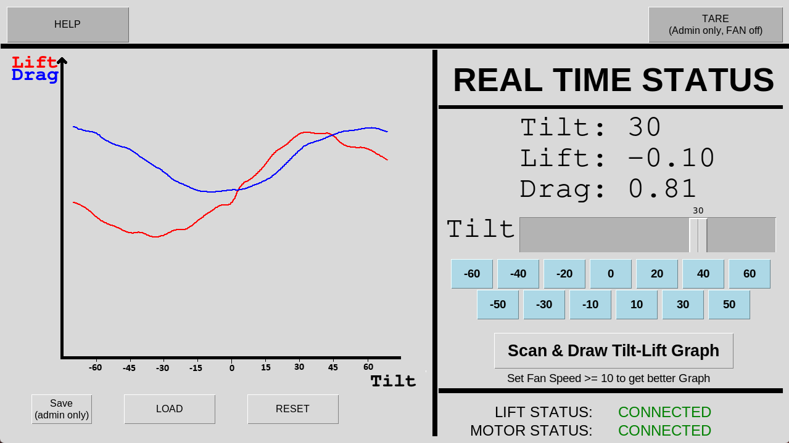

# Wind Tunnel Controller

Raspberry Pi is used as the main control interface for the wind tunnel.

## Features

- Touchscreen display
- set Tilt angle
- live update Lift/Drag
- Scan Tilt and draw Tilt vs Lift/Drag graph
- display the Lift/Motor status
- Save/Load graph
- Tare

## Hardware

- Main Controller: 
[Raspberry Pi 4 with 4GB RAM](https://www.raspberrypi.com/products/raspberry-pi-4-model-b/?variant=raspberry-pi-4-model-b-4gb)
- Display: [Official Raspberry Pi Touchscreen Display 2](https://www.raspberrypi.com/products/touch-display-2/)
- Case: [SmartPi Touch Pro 3](https://smarticase.com/collections/smartipi-touch-pro-3/products/smartipi-touch-pro-3)
- 32GB microSD card

### Assemble

Follow the instructions in the official website to install the Raspberry Pi and the display, and assemble the case.

## Software

### Install Raspberry Pi OS

Follow https://www.raspberrypi.com/software/operating-systems/ to install the Raspberry Pi OS for Raspberry Pi 4. I used 64-bit version.

When create user, create username `test` to match the configuration in this repository.

#### Change the display orientation

By default the Touch Display 2 is in portrait orientation. Follow https://www.raspberrypi.com/documentation/accessories/touch-display-2.html to change to landscape:

> If you want to physically rotate the display, or mount it in a specific position, select Screen Configuration from the Preferences menu. Right-click on the touch display rectangle (likely DSI-1) in the layout editor, select Orientation, then pick the best option to fit your needs.

### Install dependencies

1. Install Python: `sudo apt install python3 python3-pip python3-tk`
2. Setup Python environment: `python3 -m pip config set global.break-system-packages true`
3. Install required Python packages: `pip3 install matplotlib pyserial`

### Install Wind Tunnel Controller software

1. Download or clone this repository to **/home/test/wind_tunnel**: `git clone <repository_url> /home/test/wind_tunnel`
2. Copy `WindTunnel.sh` to Desktop for easy access: `cp WindTunnel.sh ~/Desktop/`
3. Copy `99wt.desktop` to autostart so that the software starts automatically when Raspberry Pi boots up:
   `mkdir -p ~/.config/autostart/ && cp 99wt.desktop ~/.config/autostart/`

### Run the software

1. From console: `~/Desktop/WindTunnel.sh`
2. From Desktop: double click `WindTunnel.sh` in the Desktop. Choose "Execute" when prompted.

## FAQ

### Use Raspberry Pi username other than `test`

To use username other than `test`, you need to change the following files:

1. Change the `Exec` in `99wt.desktop` to point to the correct path of `WindTunnel.sh`
2. Change the path in `WindTunnel.sh` to point to the correct path of directory.

### Change the serial port

By default the software uses `/dev/ttyUSB0` as the serial port to connect to the Servo Motor for tilt control. If you want to use a different port, change the `/dev/ttyUSB0` in `WindTunnel.py`.

By default the software uses `/dev/ttyACM0` as the serial port to connect to the Raspberry Pi Pico for force measurement. If you want to use a different port, change the `/dev/ttyACM0` in `WindTunnel.py`.

You can use `dmesg | grep tty` to find out the correct port.