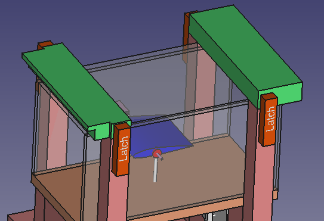
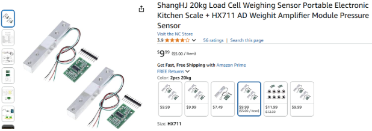

# Wind Tunnel Project Plan

Gabrielle He, 2024 (gabexl.he@gmail.com)

## Table of Contents

* [Project Goal](#project-goal)
* [Project Requirement](#project-requirement)
* [Design Thinking](#design-thinking)
  * [Architecture](#architecture)
  * [Dimensions](#dimensions)
  * [Test platform](#test-platform)
    * [Test room](#test-room)
    * [Test fixture angle adjustment](#test-fixture-angle-adjustment)
    * [Force measurement](#force-measurement)
    * [Controller](#controller)
  * [Contraction](#contraction)
    * [Flow straightener](#flow-straightener)
    * [Smoke generator](#smoke-generator)
    * [Fog fluid](#fog-fluid)
    * [Smoke nozzle](#smoke-nozzle)
    * [Building contraction](#building-contraction)
  * [Diffuser](#diffuser)
    * [Fan](#fan)
    * [Fan safety](#fan-safety)
    * [Building Diffuser](#building-diffuser)
  * [Assemble parts](#assemble-parts)
  * [Electricity](#electricity)
  * [Wood treat](#wood-treat)
    * [Sanding](#sanding)
    * [Filler](#filler)
    * [Paint](#paint)
  * [Seal the gap](#seal-the-gap)
  * [Final product CAD](#final-product-cad)
* [Tools and equipment](#tools-and-equipment)
  * [Powered Tools](#powered-tools)
  * [Hand Tools](#hand-tools)
* [Transportation](#transportation)
* [Safety](#safety)
  * [Tasks for adults only (18+)](#tasks-for-adults-only-\(18+\))
  * [Personal protective equipment](#personal-protective-equipment)
    * [Eye protection](#eye-protection)
    * [Gloves](#gloves)
    * [Masks](#masks)
    * [Closed-toe shoes](#closed-toe-shoes)
    * [Hearing protection](#hearing-protection)
  * [Safety Guidelines](#safety-guidelines)
* [Cost Estimation](#cost-estimation)
* [Citations](#citations)

## Project Goal

The goal of this project is to design and construct a portable wind tunnel that allows for hands-on modeling and exploration of aerodynamics. Compact and easily transportable by car, the wind tunnel is intended to serve a variety of users in different locations. It aims to introduce individuals to the fundamental principles of aerodynamics and the mechanics behind flight. Equipped with an adjustable model plane, the tunnel will enable users to experiment with varying angles and observe their effects, fostering a deeper understanding of how airplanes achieve and sustain flight.

## Project Requirement

1. Features  
   1. Able to demonstrate lift force and drag force of airplane  
   2. Able to change the airplane attack of angle   
   3. Able to adjust the velocity of airflow  
   4. Able to use smoke to visualize the airflow  
   5. Able to use force gauge or load cell to measure the force  
2. Transportation  
   1. Able to transport using normal pickup truck or SUV  
   2. Handles for easy maneuvering the device  
   3. Reasonable strengthening so it can survive a six inch drop.  
3. Safety  
   1. Smoke should be environment friendly. Provide MSDS for the chemical.  
   2. Safety guards for fan blades  
   3. Avoid splinters  
   4. If any glass/mirror is used, consider it’s not easy to break especially during transportation.  
4. Deliverables  
   1. Complete wind tunnel in test and working condition  
   2. Dimensioned drawings and full BOM  
   3. MSDS for all the materials  
   4. Operator’s User Manual  
   5. Manual and warranties of all OEM parts  
   6. All source codes of the software

## Design Thinking

### Architecture

Typical windtunnel will have contraction(where air comes in), test platform and diffuser(where air be pulled out).

This is a reference commercial wind tunnel:

### Dimensions

The reference product in the image above has overall dimensions 1730mm(L) \* 550mm(H) \* 550mm(W), test platform dimensions 300mm(L) \* 200mm(H) \* 200mm(W).

This project will have similar dimensions, overall 2500mm(L) \* 620mm(H) \* 550mm(W), test platform dimensions 300mm(L) \* 200mm(H) \* 200mm(W).

Considering the easy transportation of the wind tunnel, this project will make separate contraction, test platform and diffuser, and make sure they’re easy to install in the field. The sealing between the three parts will be discussed later.

The dimension of the three parts is:

1. Contraction: 1060mm(L) \* 550mm(H) \* 580mm(W)  
2. Test platform: 440mm(L) \* 500mm(H) \* 550mm(W)
3. Diffuser: 1450mm(L) \* 550mm(H) \* 550mm(W)

The contraction and diffuser have different widths in two ends. For contraction, the opening end is 550mm and the test platform end is 300mm. For Diffuser, the opening end is 550mm and the test platform end is 300mm.

Top view of the parts:

For how to transport the wind tunnel, please see [Transportation](#transportation) chapter later.

### Test platform

Test platform is where the test device gets wind, and then the user measures the forces.

#### Test room

The test room is 400mm(L) \* 200mm(W) \* 200mm(H), the visible are is 300mm(L) \* 200mm(W) \* 200mm(H), because it needs some space at the two ends to connect to the contraction and diffuser.

The test room bottom is made of wood. The front/back/top sides are made with acrylic. **10mm** thick acrylic boards are used, to have enough strength. I thought about having a mirror at the rear side of the test room, but then I realized the mirror is easy to break, and just having acrylic to allow the other user to see the test device from the other side of the wind tunnel is also sufficient.

The top acrylic board can be opened, so the end user can reach the objects on the test fixture.

 

Toggle latch will be used to fix the top cover to the test room after it’s closed.

 [POWERTEC 220 lbs. Pull Action Latch Toggle Clamp](https://www.homedepot.com/p/POWERTEC-220-lbs-Holding-Capacity-Pull-Action-Latch-Toggle-Clamp-4001-with-Red-Vinyl-Handle-Grip-32-Pack-20332-P4/321600330#overlay)

Below image shows the top locked during the test. RED rectangles are for toggle clamps.

#### Test fixture angle adjustment

Adjusting the device angle of attack is a very important feature this project will support.

A servo motor is used to adjust the angle.

This motor supports 240 degree angle change and position feedback.

The motion will connect to a rod, in the other end of the rotation rod, a Rod End Bearing is used.

To prevent the large drag caused by the motor, I put the motor out of the test room, only the test fixture is inside the test room. This can significantly reduce the drag caused by items other than test devices.

#### Force measurement

Strain gauge load cell is used to measure the force(both lift force and drag force).

A typical load cell setup is like below, it can measure the force on the top plate(both push and pull). Ref: [Load Cell Guide \- Phidgets Support](https://www.phidgets.com/docs/Load_Cell_Guide)

For the lift force, it may distribute to both the servo motor and the main VRod(vertical Rod). So we add load cells to both the servo motor and VRod, and add them together. This will be more accurate to measure the lift. See “Lift Cell1” and “Lift Cell2” below. Update: only "Lift Cell2" is used now.

For the drag force, one load cell is used, see “Drag cell” below.

The load cell output will be connected to the load cell amplifier (HX711) and then connect to the Raspberry Pi.

#### Controller

Raspberry Pi is used as the main controller for the wind tunnel.

HW: Raspberry Pi 4 with 7” display.

The Raspberry Pi HW will connect to three load cells and one Servo Motor.

The SW on Raspberry Pi GUI will allow user to:

1. Control Servo Motor to set the angle of attack  
2. Read three load cells and display the lift force and drag force  
   1. Need a reset button after install the test device to reset the force to 0

For the detailed HW circuit and SW design guide, will update later.

To secure the controller on the base board, I will consider it later. This should not be a big problem.

### Contraction

Contraction: incline of 14 degrees 

- Entrance dimensions: width 500mm \* height 500mm  
- Exit dimensions: width 200mm \* height 200mm  
- Total length: 600mm

The incline rates are similar to suggestions in the research below. Though the rates are not exactly the same as the resource, the resource states the 12 degrees as having “reasonable length and good fluid dynamics”.  
[Resource](https://www.intechopen.com/chapters/43210)

The Contraction CAD view:

#### Flow straightener

In the contraction to test platform there’s an air flow straightener to control the airflow, avoid turbulence.

I'll use 3D printer to print the flow straightener.

#### Smoke generator

After the rear flow straightener, there's a smoke machine to generate smoke for airflow visualization.

The smoke generator below will be used.

This smoke generator has a start button.

#### Fog fluid

The smoke generator needs fog fluid to generate the smoke.

[SDS](https://www.froggysfog.com/media/files/sds/bog-fog-extreme-density-fog-fluid-sds-us-102014-final.pdf)

It's non-toxic, water based, and environmentally friendly.

#### Smoke nozzle

Smoke nozzle is where the smoke gets out. It’ll be installed just after the rear air straightener.

The nozzle will installed like this:

There will be small holes on the nozzle, so the smoke can come out evenly.

#### Light Strip

For easy visualization of the smoke, a light strip will be installed on top of the test platform cover. And the test platform backside will be covered by black paper.

The light strip will be hot, so will not fully cover the light strip.

#### Building contraction

To have better airflow, the contraction is in curve shape, not trapezoid. This causes it’s not easy to build. This chapter records my idea on how to build the contraction.

1. Build the connections to the test platform. Make sure the size matches the test platform entrance size.

2. Build the 8 contraction support.

3. Install the side wall of contraction

4. Temporary fix the opening, and cut the side wall

5. Remove the side wall, and do the same for the top/down wall

6. Remove temporary opening fix, and install all the four walls

7. Fix the opening

8. Install the base

### Diffuser

Diffuser: incline of 4.7 degrees

- Entrance dimensions: width 200mm \* height 200mm  
- Exit dimensions: width 400mm \* height 400mm  
  - Fit for 16in fan dimensions (see link)  
  - [Fan](https://www.homedepot.com/p/iLIVING-1736-CFM-DC-Motor-Gray-16-in-Wall-Mounted-Shutter-Exhaust-Fan-with-Temperature-and-Humidity-Controls-Variable-Speed-ILG8SF16V-DC/329655167)  
- Total length: 1300mm

Corresponding with images of other wind tunnels (ie. see image above), most modern wind tunnels have a contraction and differ angles slightly larger than the resource recommendation.

#### Fan

This fan is used for diffuser:

The fan is 1200 CFM(cubic feet/minute), our test platform is 200mm(W) \* 200mm(H), it means the air speed in the test platform is 1200 \* 300mm \* 300mm \* 300mm / 200mm / 200mm / 60s \= 13500 mm/s \= 13.5m/s. According to [Beaufont scale chart](https://en.wikipedia.org/wiki/Beaufort_scale), it’s wind force 6, strong breeze. It’s quite good for this project.  

And this Fan supports variable speed control, we can also test different drag/lift force under different air speed.

#### Fan safety

When the fan is running, the blade is dangerous. To avoid kits touching the blade causing any injury, I plan to install a mesh after the fan. The opening of the mesh should \<= ¼” to avoid fingers getting in.

And I’ll try to leave some space between Fan and mesh, like 50mm. It’s not shown in current CAD design, but the fan blade safety will be seriously considered.

#### Building Diffuser

Build diffuser is easier than build contraction, because it’s straight, no curve.

### Assemble parts

The final wind tunnel after assemble is as below:

The same toggle latches used in the test room top cover will be used for the parts connections:

### Electricity

All of the three parts need electrical:

1. Diffuser: Exhaust Fan, 110V 1A.
2. Contraction: Smoke Generator, 5V 2A
3. Test platform: Most likely 12V 2A

This cord will be used to bring external power to the wind tunnel.

It’s rated 15 Amps, good enough.

The overall power system design as below:

1. Power cord to two outlet boxes
   1. The power cord can be stored under Diffuser when not used.
2. Smoke generator power cord connect to outlet when in use
   1. There’s cable management clips on back of test platform to hold the smoke generator power cord
   2. When smoke generator not in use, the power cord can be stored under Contraction
3. Test platform power cable is short.
   1. When not in use, the power cable should also be stored well. Will come out with a solution later.

### Wood treat

My original idea is to use the most cost efficient 2x4 construction lumber for most of the materials. This lumber is less than $4 for 2x4 8ft. But after checking these lumbers, I found these lumbers are too rough and splintery.

2x4 lumber:

The new idea is to use redwood, which has much less splinters and a smoother surface.

2x4 redwood lumber:

And to cut the wood as less as possible, I’ll use wood original width and thickness so I only need to cut length. The standard wood size is in the table below.

| Nominal Size (Inches) | Actual Size (Inches) | Actual Size (mm) | Quantity (ft) |
| :---- | :---- | :---- | :---- |
| 1 x 2 | 3/4 x 1 1/2 | 19 x 38 | 6 |
| 1 x 3 | 3/4 x 2 1/2 | 19 x 64 |  |
| 1 x 4 | 3/4 x 3 1/2 | 19 x 89 | 2 |
| 1 x 6 | 3/4 x 5 1/2 | 19 x 140 |  |
| 2 x 2 | 1 1/2 x 1 1/2 | 38 x 38 | 9 |
| 2 x 3 | 1 1/2 x 2 1/2 | 38 x 64 | 4 |
| 2 x 4 | 1 1/2 x 3 1/2 | 38 x 89 | 28 |
| 2 x 6 | 1 1/2 x 5 1/2 | 38 x 140 | 1 |

This redwood lumber is $15 for 2x4 8ft. Using redwood will increase the wood material cost from original estimation $32 to \~$100. But I think this is worth doing. It can save me much time to smooth the surface, and the final product will be very beautiful.

With this redwood lumber, we still need a process to make it smooth and splinter free. These steps are needed:

1. Sanding  
2. Filler  
3. Paint  
   1. Finish the surface with a non-toxic paint.

#### Sanding

Sander machine will be used first, to make the surface smooth.

Sandpaper has different grits for different purposes.

For this project, 80 grit will be used first to rough treat the wood, and then 220 grit to fine finish.

#### Filler

If there’s any cracks or knots in the wood, fill with wood filler and then smooth it again.

#### Paint

Paint happens after the assembly is done.

There are many types of paint available. To be health and environment friendly, we’ll use non-toxic water-based coatings. I’d like to keep the original wood color, so I plan to use a redwood color semi-transparent waterproof exterior wood stain and sealer.

[SDS](https://images.thdstatic.com/catalog/pdfImages/27/27f3fb64-bb87-412c-aa3a-92196bf9af9d.pdf)

### Seal the gap

There would be a gap between the board connections, especially between the Contract and Diffuser front/rear/top/bottom boards. We want to seal the gap to avoid air leakage.

For small gaps \<= 5mm, wood filler used in the previous chapter can be used to fix the gap as well.

Sealant/Caulk is also possible but it’s different to sand and paint.

If the gap is really big, we should consider fixing this by the board itself, maybe discard the broken board and make a new one.

### Final product CAD

Front view:

Top view:

Bottom view:

Rear view:

Left view:

Right view:

Top-Front-Right view:

Top-Rear-Left view:

## Tools and equipment

### Powered Tools

| Name | Purpose | Comment |
| ---- | ----    | ---- |
| Table Saw | Cutting wood | Used by adult only |
| Circular Saw | Cutting wood | Used by adult only |
| Jigsaw | Fine cutting wood | Used by adult only |
| Sander | Smooth wood |  |
| Cordless Screwdriver | Fasten screw |  |
| Cordless Drill | Making holes |  |

### Hand Tools

| Name | Purpose | Comment |
| ---- | ---- | ---- |
| Wrench | Fasten |  |
| Tape measure | Measurement |  |
| Pencil | Mark the position on wood |  |
| Welding toolkit | For copper tube |  |
| Paint brush | Painting |  |

Personal safety tools will be mentioned in the safety chapter later.

## Transportation

This page list the popular SUV cargo space: [https://www.mcgrathauto.com/suv-cargo-space.htm](https://www.mcgrathauto.com/suv-cargo-space.htm)

This table is in inches (mm):

|  | Ford Escape | Ford Edge | Subaru Outback | Toyota Highlander | Toyota Sienna |  |
| :---- | :---- | :---- | :---- | :---- | :---- | :---- |
| Door width | 43 in (1092 mm) | 47 in (1193 mm) | 44 in (1117 mm) | 45.5 in (1155 mm) | 50 in (1270 mm) |  |
| wheel-to-wheel width | 41.5 in (1054 mm) | 45 in (1143 mm) | 42 in (1066 mm) | 45.5 in (1155 mm) | 49 in (1244 mm) |  |
| height | 35 in (889 mm) | 32 in (812 mm) | 29.5 in (750 mm) | 29.5 in (750 mm) | 38.5 in (977 mm) |  |
| Length (2nd row fold down) | 67 in (1700 mm) | 72.5 in (1841 mm) | 61 in (1549 mm) | 83.5 in (2120 mm) | 94 in (2387 mm) |  |

All these models have enough height for the 650mm height wind tunnel.

With a reasonable gap between parts, the setup can be arranged like below(top view). The three parts need 1122mm(W) \* 1480mm(L) space, it’s good enough for all the SUVs listed above.

To make maneuvering the device easier, I added some handles in Contraction and Diffuser.

I plan to use this handle below:  

NOTE: Not recommended to move the whole wind tunnel together. Always disassemble into three parts(Contraction, Test Platform, Diffuser) and move separatedly.

## Safety

Safety is the most important thing during construction.

### Tasks for adults only (18+)

1. Power cutting tools
   1. Table saw
   2. Circular saw
   3. Jigsaw
2. Electrical work
   1. Connecting 110V AC power circuits
   2. Soldering high voltage connectors
   3. Final connection to wall power

### Personal protective equipment

#### Eye protection

Safety glasses must be worn at all times near power tools.

#### Gloves

Gloves should be worn when handling wood and paint. However, gloves should be avoided when using power tools with spinning blades or bits, as they can get caught and cause injury.

#### Masks

Use dust masks when cutting wood, sanding, and applying paint.

#### Closed-toe shoes

Closed toe shoes are required all the time.

#### Hearing protection

Optional when power saw is in operation.

### Safety Guidelines

1. Scouts should not operate a tool without adult permission and supervision
2. Only one person operates a power tool at a time \- no distractions allowed.
3. All tools must be unplugged when changing bits, blades, or making adjustments.
4. Extension cords must be secured to avoid tripping hazards.
5. Do not run or play in working area
6. All 110V connections must be done by adults
7. Never put water or drinks close to any electrical

## Cost Estimation

See BOM file.

## Citations

- Wittwer, Adrián Roberto, et al. “Statistical Analysis of Wind Tunnel and Atmospheric Boundary Layer Turbulent Flows.” IntechOpen, 6 Mar. 2013, www.intechopen.com/chapters/43210. Accessed 25 Dec. 2024\.